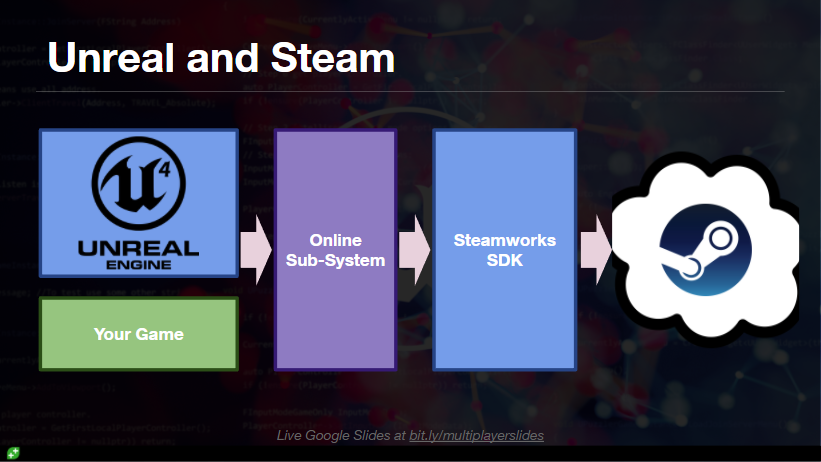

PuzzlePlatforms
--------------------------------------------------------------------------------

Build a simple multiplayer puzzle game. The goal is to build a minimum viable
product game level and to get hosting and joining a game possible. The interface
is designed in Unreal Editor and interaction programmed in C++.

## Screenshots

